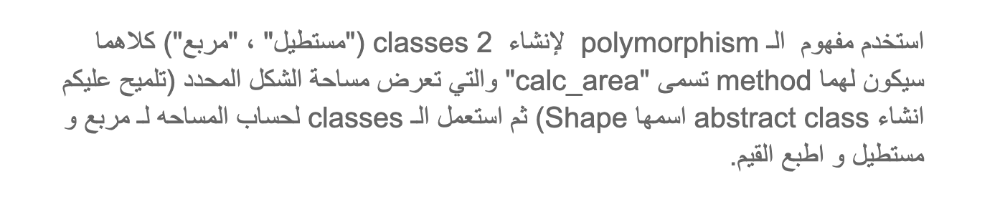

# Instructions
Use the `polymorphism` concept to create 2 classes ( “_Rectangle_”, “_Square_” ) they both will have a method called “calc_area” that returns the area of the given shape, then use the classes to calculate the area for a square and a rectangle and print the values.

> **HINT**: create a “Shape” abstract class.

# Arabic Instructions  

