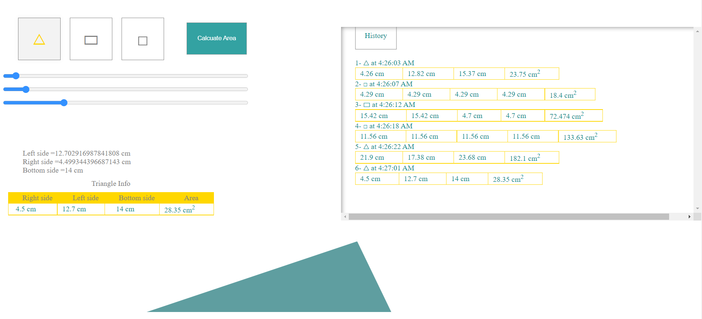

# Shape Calculator
A calculator to find areas of geometric shapes and lengths of their sides, draw them with actual sizes and keep history of calculated shapes.

---
title: ""
php_file: "index.php"
---

